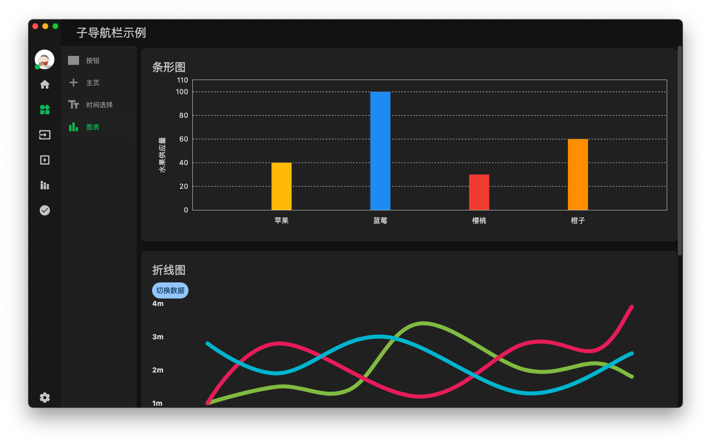
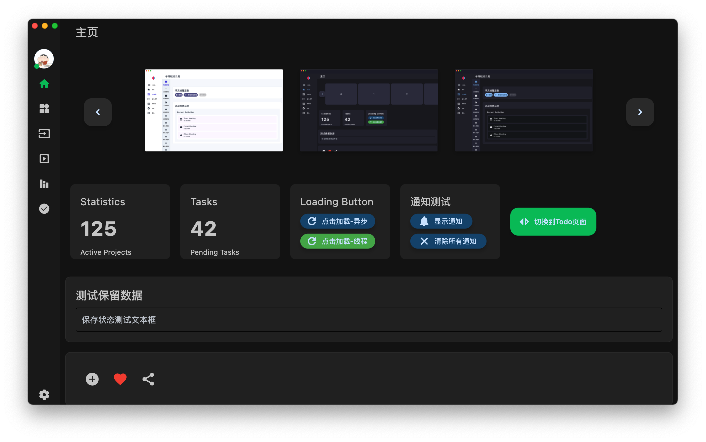
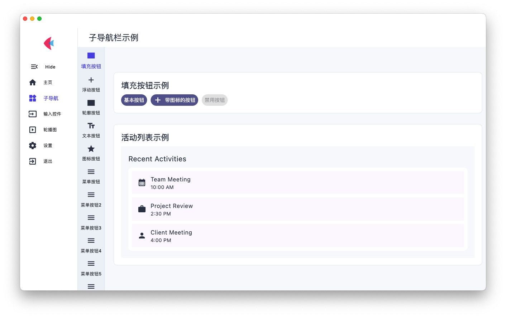
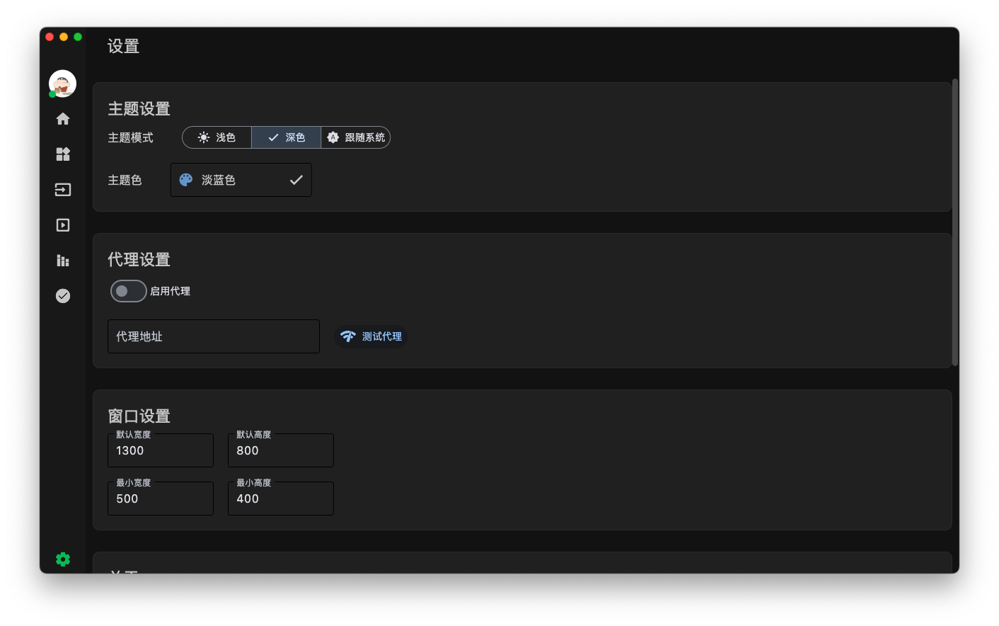

<h1 align="center">PyDracula-flet</h1>

[English](README_EN.md) | 简体中文

PyDracula-flet 是一个基于 Flet 参考 PyDracula 构建的现代化桌面应用程序模版。它提供了一套完整的主题系统、导航系统和配置管理, flet template。

## 注意事项
1. 项目主要在macos开发，windows可能存在一些问题，我会在windows上测试，如果存在问题，我会及时修复。

2. 主题配色，我在macos上测试，windows 的颜色和对比度差异可能比较大，您可以在 `app/config/theme.py` 中修改颜色，以适应您的windows系统。

## 特性

- 🌓 深色/浅色主题支持，可自定义主题色
- 📱 响应式布局，支持窗口大小调整
- 🎯 可配置的导航栏，支持主导航和子导航
- ⚙️ 配置持久化，自动保存用户偏好
- 🎨 现代化 UI 设计
- 🎢 内置轮播图组件
- 💾 本地存储支持
- 🖥️ 跨平台支持 (macOS, Windows)
- 📢 内置多种通知系统

# 项目预览

## 图片预览
## 图片预览
|  |  |
|-----------------------------------------|-----------------------------------------|
|  |  |


## 安装

1. 克隆仓库：

```bash
git clone https://github.com/clarencejh/PyDracula-flet.git
cd PyDracula-flet
```

2. 安装依赖：

```bash
pip install -r requirements.txt
```

3. 运行应用：

```bash
flet run main.py
```

## 项目结构

```
PyDracula-flet/
├── assets/            # 静态资源文件
│   └── images/       # 图片资源
├── components/        # 可重用组件
│   └── fletcarousel/ # 轮播图组件
├── app/             # 核心功能
│   ├── app.py       # 主应用类
│   ├── base_page.py # 基础页面类
│   ├── theme.py     # 主题管理
│   ├── utils/       # 工具函数
│   └── pages/            # 页面
│   │   ├── home.py      # 主页
│   │   ├── widgets.py   # 组件展示
│   │   ├── inputs.py    # 输入控件
│   │   ├── carousel.py  # 轮播图示例
│   │   ├── settings.py  # 设置页面
│   └── sub_navigation_bar/ # 子导航示例
│   └── config_manager.py  # 配置管理
├── storage/          # 本地存储
├── main.py          # 应用入口
└── requirements.txt  # 项目依赖
```

## 如何添加新页面

1. 在 `app/pages` 目录下创建新的页面文件，例如 `my_page.py`：

```python
from flet import Column, Container, Text, padding, border_radius
from core.base import BasePage

class MyPage(BasePage):
    def __init__(self, **kwargs):
        super().__init__(title="我的页面", **kwargs)

    def build_content(self) -> Column:
        container = Column(
            controls=[
                self.build_section(
                    "标题",
                    Container(
                        content=Text("Hello, World!")
                    )
                )
            ],
            scroll="auto",
            spacing=20,
        )
        return container
```

2. 在 `main.py` 中注册新页面：

```python
from app.pages.my_page import MyPage  # 导入新页面

def main(page: ft.Page):
    # ... 其他代码保持不变 ...
    
    # 注册新页面
    app.register_page(
        nav_item={"icon": Icons.STAR, "label": "我的页面"},
        page=MyPage(theme_colors=app.theme_colors, theme_mode=config.theme_mode)
    )
```

## 页面开发指南

### 主题使用

页面中可以使用 `self.theme_colors` 访问主题颜色：

- `self.theme_colors.bg_color`: 背景色
- `self.theme_colors.nav_color`: 导航栏颜色
- `self.theme_colors.card_color`: 卡片颜色
- `self.theme_colors.text_color`: 文本颜色
- `self.theme_colors.divider_color`: 分隔线颜色
- `self.theme_colors.accent_color`: 强调色

### 布局结构

每个页面应该遵循以下布局结构：

1. 使用 `BasePage` 的 `build_section` 方法创建独立的内容区块
2. 在 `build_content` 中组织这些区块
3. 使用 `scroll="auto"` 支持内容滚动
4. 保持合适的间距 (`spacing`)

### 通用方法

通用方法可以添加到 `app/base_page.py` 中。

### 状态管理限制

在切换主题时，BasePage 类只能保存和恢复作为类属性的控件状态。例如：

```python
class MyPage(BasePage):
    def __init__(self, **kwargs):
        # 将控件定义为类属性，这样可以在主题切换时保持状态
        self.my_input = ft.TextField(label="输入框")
        super().__init__(**kwargs)

    def build_content(self) -> Column:
        return Column(
            controls=[
                self.my_input  # 使用类属性中的控件
            ]
        )
```

而不是：

```python
def build_content(self) -> Column:
    # 在方法中直接创建控件，这样无法在主题切换时保持状态
    return Column(
        controls=[
            ft.TextField(label="输入框")
        ]
    )
```

## 主题系统

### 颜色配置

主题系统提供了以下颜色变量：

- `bg_color`: 背景色
- `nav_color`: 导航栏颜色
- `card_color`: 卡片颜色
- `text_color`: 文本颜色
- `divider_color`: 分隔线颜色

可以在 `core/theme.py` 中自定义这些颜色。

### 主题切换

应用支持深色和浅色主题切换，并且会自动保存用户的主题偏好。主题切换通过以下方式实现：

1. 在设置页面中切换
2. 通过配置文件预设
3. 程序启动时自动加载上次的主题设置


## 开发指南

### 添加新页面

1. 在 `pages` 目录下创建新的页面文件
2. 继承 `BasePage` 类
3. 在 `main.py` 中注册页面

4. 如果需要添加子导航栏，请在 `pages/sub_navigation_bar/app.py` 中添加

示例：

```python
from core.base import BasePage
from flet import Column, Container, Text

class MyPage(BasePage):
    def __init__(self, **kwargs):
        super().__init__(title="新页面", **kwargs)

    def build_content(self) -> Column:
        return Column(
            controls=[
                self.build_section(
                    "标题",
                    Container(
                        content=Text("内容")
                    )
                )
            ],
            scroll="auto",
            spacing=20,
        )
```

### 状态管理

为了支持主题切换时保持状态，请将控件定义为类属性：

```python
class MyPage(BasePage):
    def __init__(self, **kwargs):
        super().__init__(**kwargs)

    def build_content(self):
        self.my_text = Text("Hello")  # ✅ 正确
        text = Text("World")  # ❌ 错误
        return Column(controls=[self.my_text])
```

### 最佳实践

1. 使用 `build_section` 方法创建独立的内容区块
2. 保持适当的代码组织和文件结构
3. 遵循 Python 代码规范
4. 添加适当的注释和文档
5. 使用类型提示增加代码可读性

## 其他

1. 轮播图组件使用的是 [fletcarousel](https://github.com/clarencejh/fletcarousel)
2. flet 中文文档: [https://flet.qiannianlu.com/docs/getting-started/](https://flet.qiannianlu.com/docs/getting-started/)
3. flet 官方文档: [https://flet.dev/docs/](https://flet.dev/docs/)

## 单独的运行文件

在 `single_main.py` 中，可以单独运行，不需要使用其他文件。但不再更新内容。

## 许可证

此项目采用 MIT 许可证。有关详细信息，请参阅 [LICENSE](LICENSE) 文件。

## 联系

如需更多信息，请访问我们的 GitHub 页面：[PyDracula-flet](https://github.com/clarencejh/PyDracula-flet)
