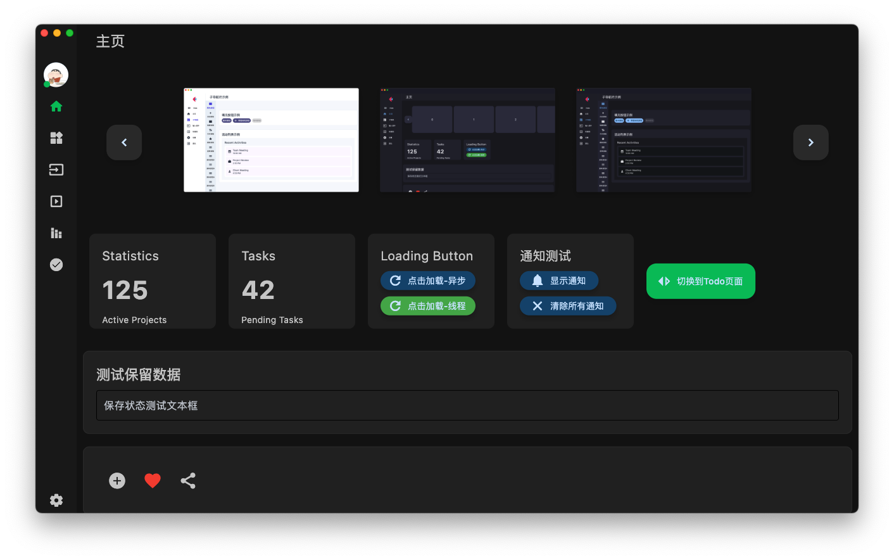

<h1 align="center">PyDracula-flet</h1>

English | [简体中文](README.md)

PyDracula-flet is a modern desktop application template built with Flet, inspired by PyDracula. It provides a complete theme system, navigation system, and configuration management.

[PyDracula](https://github.com/Wanderson-Magalhaes/Modern_GUI_PyDracula_PySide6_or_PyQt6) is a modern desktop application template built with PyQt5.

## Important Notes
1. The project is primarily developed on macOS. While it should work on Windows, there might be some issues that we're actively working to identify and fix.

2. The theme colors have been tested on macOS. Windows users might experience different color contrasts and may need to adjust colors in `app/theme.py` to better suit their system.

## Features

- 🌓 Dark/Light theme support with customizable theme colors
- 📱 Responsive layout with window resizing support
- 🎯 Configurable navigation bar with main and sub-navigation
- ⚙️ Persistent configuration with automatic user preference saving
- 🎨 Modern UI design
- 🎢 Built-in carousel component
- 💾 Local storage support
- 🖥️ Cross-platform support (macOS, Windows)
- 📢 Built-in notification systems

# Project Preview

## Screenshots
|  |  |
|-----------------------------------------|-----------------------------------------|
|  |  |


## Installation

1. Clone the repository:

```bash
git clone https://github.com/clarencejh/PyDracula-flet.git
```

2. Install dependencies:

```bash
pip install -r requirements.txt
```

3. Run the application:

```bash
flet run main.py
```

## Project Structure

```
PyDracula-flet/
├── assets/            # Static resources
│   └── images/       # Image resources
├── components/        # Reusable components
│   └── fletcarousel/ # Carousel component
├── config/           # Configuration files
│   ├── config.ini   # Application config
│   └── version.py   # Version info
├── app/             # Core functionality
│   ├── app.py       # Main app class
│   ├── base_page.py # Base page class
│   ├── theme.py     # Theme management
│   └── config_manager.py  # Config management
├── pages/            # Pages
│   ├── home.py      # Home page
│   ├── widgets.py   # Widget showcase
│   ├── inputs.py    # Input controls
│   ├── carousel.py  # Carousel example
│   ├── settings.py  # Settings page
│   └── sub_navigation_bar/ # Sub-navigation examples
├── storage/          # Local storage
├── utils/           # Utility functions
├── main.py          # Application entry
└── requirements.txt  # Project dependencies
```

## Adding New Pages

1. Create a new page file in the `pages` directory, e.g., `my_page.py`:

```python
from flet import Column, Container, Text, padding, border_radius
from app.base_page import BasePage

class MyPage(BasePage):
    def __init__(self, **kwargs):
        super().__init__(title="My Page", **kwargs)

    def build_content(self) -> Column:
        container = Column(
            controls=[
                self.build_section(
                    "Title",
                    Container(
                        content=Text("Hello, World!")
                    )
                )
            ],
            scroll="auto",
            spacing=20,
        )
        return container
```

2. Register the new page in `main.py`:

```python
from app.pages.my_page import MyPage  # Import new page

def main(page: ft.Page):
    # ... other code remains unchanged ...
    
    # Register new page
    app.register_page(
        nav_item={"icon": Icons.STAR, "label": "My Page"},
        page=MyPage(theme_colors=app.theme_colors, theme_mode=config.theme_mode)
    )
```

## Development Guide

### Using Themes

Access theme colors in pages via `self.theme_colors`:

- `self.theme_colors.bg_color`: Background color
- `self.theme_colors.nav_color`: Navigation bar color
- `self.theme_colors.card_color`: Card color
- `self.theme_colors.text_color`: Text color
- `self.theme_colors.divider_color`: Divider color

### Layout Structure

Each page should follow this layout structure:

1. Use `BasePage`'s `build_section` method to create independent content blocks
2. Organize these blocks in `build_content`
3. Use `scroll="auto"` for content scrolling
4. Maintain appropriate spacing

### Configuration Management

For pages needing configuration storage:

```python
def __init__(self, config_manager=None, **kwargs):
    self.config_manager = config_manager
    super().__init__(**kwargs)

def save_setting(self, section: str, key: str, value: str):
    if self.config_manager:
        self.config_manager.set(section, key, value)
```

### Common Methods

Common methods can be added to `core/base_page.py`.

### State Management Limitations

When switching themes, BasePage can only save and restore widget states defined as class attributes:

```python
class MyPage(BasePage):
    def __init__(self, **kwargs):
        # Define widgets as class attributes for state preservation
        self.my_input = ft.TextField(label="Input")
        super().__init__(**kwargs)

    def build_content(self) -> Column:
        return Column(
            controls=[
                self.my_input  # Use widget from class attributes
            ]
        )
```

Instead of:

```python
def build_content(self) -> Column:
    # Creating widgets directly in method won't preserve state
    return Column(
        controls=[
            ft.TextField(label="Input")
        ]
    )
```

## Theme System

### Color Configuration

The theme system provides these color variables:

- `bg_color`: Background color
- `nav_color`: Navigation bar color
- `card_color`: Card color
- `text_color`: Text color
- `divider_color`: Divider color

Customize these colors in `core/theme.py`.

### Theme Switching

The application supports dark and light theme switching with automatic preference saving. Theme switching is implemented through:

1. Settings page toggle
2. Configuration file preset
3. Automatic loading of last theme setting on startup

## Contributing

Contributions are welcome! Please feel free to submit a Pull Request. 