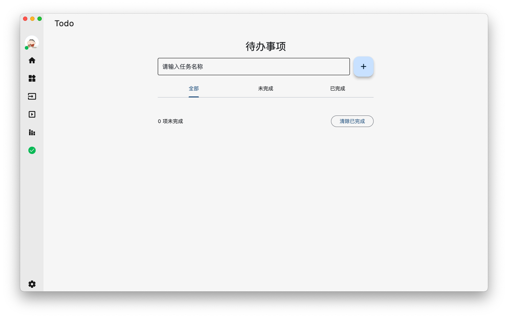
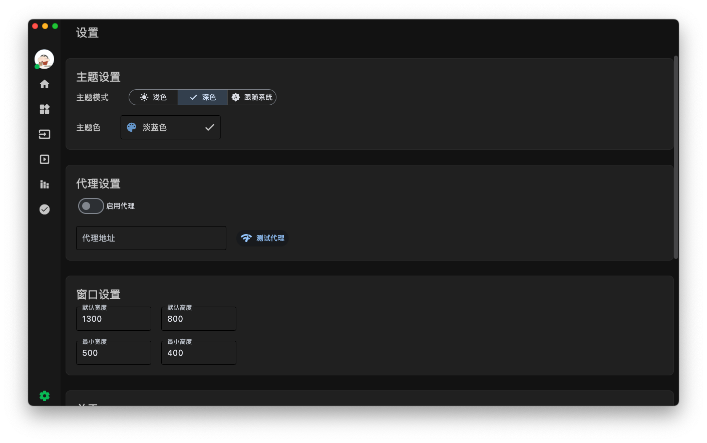

<h1 align="center">PyDracula-flet</h1>

[简体中文](README.md) | English

PyDracula-flet is a modern desktop application template built with Flet, inspired by PyDracula. It provides a complete theme system, navigation system, and configuration management.

## Important Notes
1. The project is primarily developed on macOS. While it works on Windows, there might be some issues that we are actively testing and fixing.

2. The theme colors have been tested on macOS. Due to differences in color and contrast on Windows, you may need to adjust colors in `app/config/theme.py` to better suit your Windows system.

## Features

- 🌓 Dark/Light theme support with customizable colors
- 📱 Responsive layout with window size adaptation
- 🎯 Configurable navigation bar with main and sub-navigation
- ⚙️ Persistent configuration with automatic user preference saving
- 🎨 Modern UI design
- 🎢 Built-in carousel component
- 💾 Local storage support
- 🖥️ Cross-platform support (macOS, Windows)
- 📢 Built-in notification systems
- 🎵 Music player example
- ✅ Todo application example
- 🧮 Calculator example

# Project Preview

## Screenshots
|  |  |
|-----------------------------------------|-----------------------------------------|
|  |  |

## Installation

1. Clone the repository:

```bash
git clone https://github.com/clarencejh/PyDracula-flet.git
cd PyDracula-flet
```

2. Install dependencies:

```bash
pip install -r requirements.txt
```

3. Run the application:

```bash
flet run main.py
```

## Project Structure

```
PyDracula-flet/
├── assets/            # Static resources
│   └── images/       # Image resources
├── components/        # Reusable components
│   └── fletcarousel/ # Carousel component
├── app/              # Core functionality
│   ├── app.py       # Main application class
│   ├── base_page.py # Base page class
│   ├── theme.py     # Theme management
│   ├── utils/       # Utility functions
│   ├── pages/       # Pages
│   │   ├── home.py      # Home page
│   │   ├── calc.py      # Calculator
│   │   ├── player.py    # Music player
│   │   ├── todo.py      # Todo app
│   │   ├── inputs.py    # Input controls
│   │   ├── carousel.py  # Carousel example
│   │   ├── settings.py  # Settings page
│   │   └── stack_page.py # Stack layout example
│   ├── sub_navigation_bar/ # Sub-navigation example
│   └── config_manager.py  # Configuration management
├── storage/          # Local storage
├── main.py          # Application entry
└── requirements.txt  # Project dependencies
```

## Built-in Pages

1. Home Page (HomePage)
   - Displays application overview and basic information

2. Sub-navigation Example (SubNavigationBar)
   - Demonstrates multi-level navigation structure

3. Music Player (MusicPlayer)
   - Basic music playback functionality example

4. Input Controls (InputsPage)
   - Showcases various input control examples

5. Carousel (CarouselPage)
   - Image carousel component example

6. Stack Layout (StackPage)
   - Stack layout usage example

7. Todo Application (TodoPage)
   - Complete todo item management functionality

8. Calculator (CalcPage)
   - Basic calculator implementation

## Adding New Pages

1. Create a new page file in the `app/pages` directory, for example `my_page.py`:

```python
from flet import Column, Container, Text, padding, border_radius
from core.base import BasePage

class MyPage(BasePage):
    def __init__(self, **kwargs):
        super().__init__(title="My Page", **kwargs)

    def build_content(self) -> Column:
        container = Column(
            controls=[
                self.build_section(
                    "Title",
                    Container(
                        content=Text("Hello, World!")
                    )
                )
            ],
            scroll="auto",
            spacing=20,
        )
        return container
```

2. Register the new page in `main.py`:

```python
from app.pages.my_page import MyPage

def main(page: ft.Page):
    # ... other code remains unchanged ...
    
    pages = [
        # ... existing pages ...
        {"icon": ft.Icons.STAR, "name": "My Page", "page_class": MyPage},
    ]
    
    app.register_pages(pages)
```

## Theme System

### Theme Configuration

In `app/config_manager.py`, you can configure:

- Theme mode (Dark/Light)
- Theme colors
- Font settings
- Language settings

### Color System

The theme system provides the following color variables:

- `bg_color`: Background color
- `nav_color`: Navigation bar color
- `card_color`: Card color
- `text_color`: Text color
- `divider_color`: Divider color
- `accent_color`: Accent color

## Development Guidelines

1. State Management
   - Define widgets that need to persist during theme switching as class attributes
   - Use configuration manager to save user settings

2. Page Development
   - Inherit from BasePage class
   - Use build_section method to organize content
   - Maintain appropriate spacing and layout structure

3. Performance Optimization
   - Use asynchronous operations appropriately
   - Avoid frequent widget rebuilds
   - Implement caching mechanisms where appropriate

## Contributing

1. The carousel component uses [fletcarousel](https://github.com/clarencejh/fletcarousel)
2. Flet Chinese documentation: [https://flet.qiannianlu.com/docs/getting-started/](https://flet.qiannianlu.com/docs/getting-started/)
3. Flet official documentation: [https://flet.dev/docs/](https://flet.dev/docs/)

## Standalone File

`single_main.py` can be run independently without requiring other files. However, it is no longer being updated.

## License

This project is licensed under the MIT License. See the [LICENSE](LICENSE) file for details.

## Contact

For more information, please visit our GitHub page: [PyDracula-flet](https://github.com/clarencejh/PyDracula-flet) 